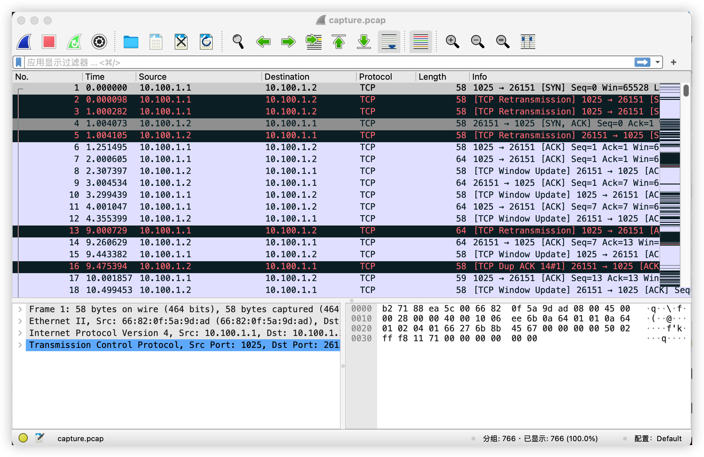

# PKU-CompNet (H) Fall’23 Lab Assignment (Premium): Protocol Stack

寿晨宸 2100012945

## 1 Lab 1: Link-layer

### 1.1 Writing Task 1(WT1)

> Open `trace.pcap` with Wireshark. First set filter to `eth.src == 6a:15:0a:ba:9b:7c` to only reserve Ethernet frames with source address `6a:15:0a:ba:9b:7c`. Find the third frame in the filtered results and answer the following questions.
>
> 1. How many frames are there in the filtered results? (Hint: see the status bar)
> 2. What is the destination address of this Ethernet frame and what makes this address special?
> 3. What is the `71th` byte (count from 0) of this frame?

The third frame in the filtered results is:

| No. | Time     | Source  | Destination     | Protocol | Length | Info                                      |
| --- | -------- | ------- | --------------- | -------- | ------ | ----------------------------------------- |
| 12  | 1.068164 | 0.0.0.0 | 255.255.255.255 | DHCP     | 342    | DHCP Discover - Transaction ID 0x13699715 |

1. There are 827 frames in the filtered results.
2. `ff:ff:ff:ff:ff:ff`, the broadcast address.

   > Frames are addressed to reach every computer on a given LAN segment if they are addressed to MAC address FF:FF:FF:FF:FF:FF. Ethernet frames that contain IP broadcast packages are usually sent to this address.
   > *__by Wikipedia__*
   >
3. 0x15.

### 1.2 Programming Task 1(PT1)

I have implemented network device management functionality in the files `src/lib/device.cpp` and `src/include/device.h`. In these files, I have abstracted two classes named `Device` and `DeviceManager`. The `Device` class contains various information about network devices, such as name, MAC address, device number, etc., and functions for operating on the device. The `DeviceManager` class contains a list of `Device` objects and implements various operations for managing these devices.

For this programming task, which is the implementation of network device management, specifically, I have implemented the following functionalities (all are member functions of `DeviceManager`):

1. `dev_id addDevice(const char* dev_name)`: Adds a device to the list of devices based on the given device name. This function completes the initial setup for the device, such as recording the device's MAC address, setting up a thread dedicated to handling receive callbacks, and so on. It returns a device identifier, which is the device's index in the device list (linearly increasing).
2. `Device* findDevice(const char* dev_name)`: Retrieves the device object based on the given device name (equivalent to getting the device by its ID; it does not affect functionality).
3. `Device* getDevice(dev_id id)`: Retrieves the device object based on the given device identifier.
4. `void printAllValidDevice() const`: A utility function for printing information about all currently valid devices owned by the network namespace.
5. `void printAllAddedDevice() const`: A utility function for printing information about all devices that have been added.

### 1.3 Programming Task 2(PT2)

I have implemented the functionality for sending and receiving Ethernet II frames in the files `src/lib/device.cpp`, `src/include/device.h`, `src/include/type.h`, `src/include/callback.h`, and `src/lib/callback.cpp`.

In `type.h`, I have provided some commonly used type definitions. In `callback.h` and `callback.cpp`, I have implemented a reusable receive callback function as an auxiliary function (in actual test programs, I have redesigned new functions based on specific scenarios).

For this task, I have primarily implemented the following functions, all of which are related to the `Device` class (member or friend functions):

1. `Device(char* dev_name, u_char* mac, dev_id id, DeviceManager* manager)`: Constructor function. Sets various members and starts a new thread for listening to messages.
2. `int sendFrame(const void* buf, int len, int ethtype, const void* destmac)`: Constructs an Ethernet II frame and sends the message.
3. `int setFrameReceiveCallback(frameReceiveCallback callback)`: Sets the callback function.
4. `friend void deviceRecvFrame(Device* device)`: Function run by the thread listening to messages, running `pcap_loop` inside it.
5. `friend void deviceRecvPcapHandler(u_char* args, const pcap_pkthdr* head, const u_char* packet)`: Program run by `pcap_loop`. When a message is received, it runs the callback function if it is not empty.
6. `int stopRecv()`: An auxiliary function to stop listening and set the callback function to NULL.
7. `const char* getDeviceName() const`: An auxiliary function to get the device name.
8. `const int getDeviceID() const`: An auxiliary function to get the device ID.
9. `const u_char* getDeviceMac() const`: An auxiliary function to get the device's MAC address.
10. `~Device()`: Destructor function that joins the listening thread and releases allocated resources.

In all of the above operations, I have used mutex to ensure thread safety.

### 1.4 Checkpoint 1(CP1)

For Checkpoint 1 (CP1), the implementation code is located in `checkpoints/CP1/{cp1.sh and cp1.txt}` and `src/tests/ethernet/test_device_manager.cpp`. The main idea is to perform a series of device management operations in a network built based on `vnetUtils/examples` within `ns3` , and record their outputs.

1. `test_device_manager <input_file>`: This is a testing tool provided for CP1, which takes one parameter representing an input file. If the parameter is empty, it reads from standard input. For example, when given an input file, this program reads the file and treats each line as a command for device management operations. It calls the functions implemented in PT1 and outputs the operation results. The operation commands include:

   - `addDevice <dev_name>`
   - `findDevice <dev_name>`
   - `findAllAddedDevice`
   - `findAllValidDevice`
   - `exit`
2. `cp1.sh`: In simple terms, this script uses `vnetUtils/examples` to build a network, calls `test_device_manager` within `ns3` , and uses `cp1.sh` as the input file (which contains a series of device management operations). It outputs the results to `cp1.log`. The `typescript` file in this directory records the process of running this script.

### 1.5 Checkpoint 2(CP2)

For Checkpoint 2 (CP2), the implementation code is located in `checkpoints/CP2/cp2.sh`, `src/tests/ethernet/{set_sender and set_receiver}.cpp`. The main idea is to establish a network based on `vnetUtils/examples` and enable multiple rounds of communication between connected devices, while recording their output.

1. `set_sender <dev> <dst_mac> <send_num>`: This sets up the sender. Each parameter represents the device name for sending, the destination MAC address, and the number of messages to send. After running this program, the device `dev` will send `send_num` rounds of frames to `dst_mac`, where each round of sending has a different payload. The payload looks like __"Hello! This is message 10 from device veth0-3 with mac 7a:85:90:d4:1b:cc."__ for easy calibration, identification, and verification. It also outputs relevant information during the sending process, such as:

   ```log
   [INFO] Device veth3-0 send frame 1:
   src_mac: 66:a4:fd:02:9b:30
   dst_mac: 7a:85:90:d4:1b:cc
   pay_load: Hello! This is message 1 from device veth3-0 with mac 66:a4:fd:02:9b:30.
   pay_load_len: 72
   ethtype: 0x8888
   ```
2. `set_receiver <dev> <recv_num>`: This sets up the receiver. Each parameter represents the device name for receiving and the number of messages to receive. After running this program, whenever the `dev` device receives a message, it prints related information. This is used for cross-checking against the sent messages.

   ```log
   [INFO] Device veth0-3 receive frame 1.
   src_mac: 66:a4:fd:02:9b:30
   dst_mac: 7a:85:90:d4:1b:cc
   pay_load: Hello! This is message 1 from device veth3-0 with mac 66:a4:fd:02:9b:30.
   pay_load_len: 72
   ethtype: 0x8888
   ```
3. `cp2.sh`: In simple terms, this script uses `vnetUtils/examples` to build a network and tests communication between each veth pair within the network. For example, it first sets `veth0-3` and `veth3-0` as receivers, and then it allows `veth0-3` and `veth3-0` to send 100 messages to each other, recording their outputs. The output logs for both receivers and senders are saved in the `checkpoints/CP2/log/` folder.

   - For the receiver, the log file, for example, `veth0-3_receive.log`, records the following information:

     ```log
     [INFO] Device veth0-3 ready to receive 100 frames.
     [INFO] Device veth0-3 receive frame 1.
     src_mac: 66:a4:fd:02:9b:30
     dst_mac: 7a:85:90:d4:1b:cc
     pay_load: Hello! This is message 1 from device veth3-0 with mac 66:a4:fd:02:9b:30.
     pay_load_len: 72
     ethtype: 0x8888
     [INFO] Device veth0-3 receive frame 2.
     src_mac: 66:a4:fd:02:9b:30
     dst_mac: 7a:85:90:d4:1b:cc
     pay_load: Hello! This is message 2 from device veth3-0 with mac 66:a4:fd:02:9b:30.
     pay_load_len: 72
     ethtype: 0x8888
     [INFO] Device veth0-3 has received 2 frames, expect 2 frames.
     [INFO] Device veth0-3 stop receiving frames.
     ```
   - For the sender, the log file, for example, `veth3-0_send.log`, records similar information:

     ```log
     [INFO] Device veth3-0 send frame 1:
     src_mac: 66:a4:fd:02:9b:30
     dst_mac: 7a:85:90:d4:1b:cc
     pay_load: Hello! This is message 1 from device veth3-0 with mac 66:a4:fd:02:9b:30.
     pay_load_len: 72
     ethtype: 0x8888
     [INFO] Device veth3-0 send frame 2:
     src_mac: 66:a4:fd:02:9b:30
     dst_mac: 7a:85:90:d4:1b:cc
     pay_load: Hello! This is message 2 from device veth3-0 with mac 66:a4:fd:02:9b:30.
     pay_load_len: 72
     ethtype: 0x8888
     ```

   Generally, you can compare the output logs of receivers and senders to validate the correctness of the code.

   - `checkpoints/CP2/typescript` records the log information during the execution of `cp2.sh`.

## 2 Lab 2:  Network-layer

### 2.1 Writing Task 2(WT2)

> Open `trace.pcap` with Wireshark. Answer the following questions.
>
> 1. During an ARP interaction, which field in ARP Reply is the same as the Sender MAC address in ARP Request?
> 2. How many IPv4 packets are there whose Don’t fragment bit is not set?
> 3. What are the header lengths of IPv4 and IPv6 packets respectively (not including IP options)?

1. The Target MAC address field.
2. 6
3. IPv4: 20 bytes. IPv6: 40 bytes.

### 2.2 Programming Task 3 (PT3)

I primarily implemented the IPv4 protocol in the files `IP.h`, `callback.h`, `device.h`, `ARP.h` and `route.h`.

I implemented IPv4-related data structures in `IP.h` and handled the reception and transmission of IP datagrams in `device.h`.

I implemented a basic ARP protocol in `ARP.h` to obtain MAC addresses corresponding to IP addresses.

In `route.h`, I implemented a routing algorithm similar to RIP (Routing Information Protocol).

In `callback.h`, I implemented various callback functions that can be applied to print various packet information.

In `utils.h`, I implemented some utilities, such as checksum calculation and IP prefix matching.

For ease of use, I implemented a simple interactive terminal in `src/tests/ip/host_manager.cpp`. Please refer to the code for specific usage instructions.

### 2.3 Writing Task 3 (WT3)

To obtain the MAC address corresponding to an IP address through the ARP protocol, you would follow these steps:

1. __Querying the ARP Cache__: First, check if the IP-to-MAC mapping is already present in the ARP cache. The ARP cache typically stores mappings for devices directly connected to the host.
2. __ARP Request Broadcast__: If the mapping is not present in the ARP cache, you would need to use the ARP protocol to resolve it. You send an ARP request packet as a broadcast to the local network. This packet contains the target IP address you want to map to a MAC address.

   - The source host or router broadcasts an ARP request to all devices on the network.
   - All devices on the network check if the destination IP address in the ARP request matches their own IP address.
3. __Response from Target Host__: When the target host (or router) receives the ARP request, it does two things:

   - It adds the source host's IP address and corresponding MAC address to its own ARP cache mapping table.
   - It sends a unicast ARP response packet to the source host, specifying its own MAC address.
4. __Updating ARP Cache on Source Host__: When the source host receives the ARP response packet, it adds the target host's IP address and MAC address to its ARP cache mapping table.

With the ARP cache updated on both the source and target hosts, the source host can now send Ethernet frames to the target host using the resolved MAC address.

This process allows devices to dynamically learn and maintain the mappings between IP addresses and MAC addresses on a local network, making it essential for proper network communication.

For devices that are not directly connected to the host, we don't need to concern ourselves with their MAC addresses because there is no need to directly send Ethernet data frames to them.

### 2.4 Writing Task 4 (WT4)

For the routing algorithm, I implemented the RIP protocol.

The RIP protocol (Routing Information Protocol) is an interior gateway protocol based on distance vectors, which measures route cost based on hops for route selection. When a host is activated, all devices within the host will broadcast RIP Requests at intervals of `RIP_UPDATE_TIME` (2 seconds), which contain information about the sender. Upon receiving RIP Requests, other devices will also broadcast RIP Replies, including their routing tables.

When a host receives a RIP Reply, it updates its own routing table:

1. When the host is activated, the routing table only contains networks directly connected to the host, with a distance of 0.
2. Within the host, there is a timer for each routing table entry that maintains an `invalid_timer` and a `flush_timer` to check if devices are still valid. Both timers are initially set to `RIP_INVALID_TIME (6)` and `RIP_FLUSH_TIME (4)`. Every second, the `invalid_timer` decreases by one. When `invalid_timer` reaches 0, the distance for that entry is set to `RIP_MAX_DISTANCE` (16, meaning unreachable), and the `valid` flag is set to false. Furthermore, every second, the `flush_timer` decreases by one, and when it reaches 0, the entry is deleted.
3. Upon receiving RIP Requests and RIP Replies, the sender's IP prefix is examined to refresh the corresponding routing table entry.
4. Upon receiving a RIP Reply, the RIP Reply packet and routing table are examined. It iterates through the entries in the RIP Reply: {`dest_ip`, `next_hop`, `d`}, with `src_ip` being the IP address of the RIP sender.

   - If `dest_ip` is not in the routing table, and `d` is less than `RIP_MAX_DISTANCE`, the entry is inserted into the routing table with `dest_ip_1=dest_ip`, `d1=d+1`, and `next_hop_1=src_ip`. Otherwise, nothing is done.
   - If `dest_ip` is already in the routing table, and the routing table entry is `dest_ip_1, d1, next_hop_1`:

     - If `next_hop` is the current host, it is skipped to prevent loops.
     - If `next_hop_1=src_ip` and `d` is less than `RIP_MAX_DISTANCE`, `d1` is set to `d+1`. If `d` equals `RIP_MAX_DISTANCE`, the entry is marked as invalid.
     - If `d+1` is less than `d1`, `next_hop_1` is set to `src_ip`, and `d1` is set to `d+1`.

When host A sends a message to host B, it sequentially queries the `next_hop` node and forwards the IP packet to the next node.

This implementation effectively prevents loops and allows the host to quickly detect changes in neighboring nodes and converge rapidly.

### 2.5 Checkpoint 3(CP3)

I implemented this task in `checkpoints/CP3`. You can obtain the results by running `./cp3.sh`. The `typescript` and `./log` files contain the execution logs, and `./action` records the behavior of various hosts. Captured IPv4 packets are stored in `ip_example.pcap`, and the specific hexdump is as follows:

```vim
0000   56 fb 21 64 a4 94 c2 47 71 fa 54 1d 08 00 45 00   V.!d...Gq.T...E.
0010   00 4e 00 00 40 00 10 fd f7 44 0a 64 01 02 0a 64   .N..@....D.d...d
0020   01 01 48 65 6c 6c 6f 21 20 54 68 69 73 20 69 73   ..Hello! This is
0030   20 61 6e 20 49 50 20 70 61 63 6b 65 74 20 66 72    an IP packet fr
0040   6f 6d 20 31 30 2e 31 30 30 2e 31 2e 32 20 74 6f   om 10.100.1.2 to
0050   20 31 30 2e 31 30 30 2e 31 2e 31 2e 00 00 00 00    10.100.1.1.....
```

- Destination MAC: `56 fb 21 64 a4 94`
- Source MAC: `c2 47 71 fa 54 1d`
- Ethertype: `0x0800`, IPv4
- Version: `0x4`, IPv4
- IHL: `0x5`
- Type of Service: `0x00`
- Total Length: `0x004e`
- Identification: `0x0000`
- Flags: `0b010`; Fragment Offset:`0b0 0000 0000 0000`
- Time to Live: `0x10`
- Protocol: `0xfd`, protocol preserved for test.
- Header Checksum: `0xf744`
- Source IP Address: `0x0a640102`->`10.100.1.2`
- Destination IP Address: `0x0a640101`->`10.100.1.1`
- Pay load: Other bytes, `Hello! This is an IP packet from 10.100.1.2 to 10.100.1.1.`

### 2.6 Checkpoint 4(CP4)

I implemented this task in `checkpoints/CP4`. You can obtain the results by running `./cp4.sh`. The `typescript` and `./log` files contain the execution logs, and `./action` records the behavior of various hosts. `./log/*cli.log` include the result of the program. `./log/*trace.log` record the program running trace(more detail).

In this task, I constructed the required network topology as follows:

```txt
ns1--ns2--ns3--ns4. 
```

I conducted the experiment following these steps:

1. Activated all hosts and waited for 10 seconds. Afterward, I printed all routing tables and ARP caches, which displayed the correct information.
2. Instructed `ns1` to send two IP packets to `ns4`, and it was observed that `ns4` successfully received the packets.
3. Forced `ns2`  to go offline, waited for 20 seconds, and then printed the routing tables and ARP caches of the other hosts. It was noticed that all entries related to `ns2`  were correctly removed.
4. Reactivated `ns2` , waited for 10 seconds, and printed all routing tables and ARP caches, which once again displayed the correct information.
5. Directed `ns1` to send two IP packets to `ns4` , and it was confirmed that `ns4`  smoothly received the packets.

This sequence of actions demonstrated the proper functioning of the network topology and the resilience of the implemented routing and ARP protocols.

### 2.7 Checkpoints 5(CP5)

I implemented this task in `checkpoints/CP5`. You can obtain the results by running `./cp5.sh`. The typescript and `./log` files contain the execution logs, and `./action` records the behavior of various hosts.

In this task, I constructed the requested network topology:

```txt
ns1 --- ns2  --- ns3  --- ns4 
         |       |
        ns5  --- ns6
```

I conducted the experiment following these steps:

1. Activated all hosts.
2. Waited for 10 seconds, then had all hosts print their routing tables. You can verify this in the log/*cli.log file, and all distances were correct.
3. Forced `ns5`  to go offline, waited for 15 seconds, and had all other hosts print their routing tables. It was observed that the entries related to `ns5`  were deleted, and distances were adjusted correctly.
4. Waited for 5 seconds, reactivated `ns5` , and then waited for another 10 seconds. Afterward, all other hosts printed their routing tables. The results were the same as the first time and were correct.

For example, the routing table of `ns1` undergoes the following changes:

```log
> setUpHost
Set up the Host.
Add Device veth1-2.
Set IP receive callback.
All added devices below: 
device 0 veth1-2: 
 ether d6:39:5b:d4:6d:07
 inet: 10.100.1.1
 netmask: 255.255.255.0
[INFO][DeviceManager::printARPCache()]
-------------------------------------------------------------------
| IP                             | MAC                            |
-------------------------------------------------------------------
| 10.100.1.1                     | d6:39:5b:d4:6d:07              |
-------------------------------------------------------------------
[INFO][DeviceManager::printRouteTable()]
-------------------------------------------------------------------------------------------------------------------------------
| Destination IP  | Net Mask        | Next Hop IP     | Distance        | Invalid Timer   | Flush Timer     | Valid           |
-------------------------------------------------------------------------------------------------------------------------------
| 10.100.1.0      | 255.255.255.0   | 0.0.0.0         | 0               | 6               | 4               | 1               |
-------------------------------------------------------------------------------------------------------------------------------

> 
> sleep 10
Sleep 10 seconds.
> 
> printRouteTable
[INFO][DeviceManager::printRouteTable()]
-------------------------------------------------------------------------------------------------------------------------------
| Destination IP  | Net Mask        | Next Hop IP     | Distance        | Invalid Timer   | Flush Timer     | Valid           |
-------------------------------------------------------------------------------------------------------------------------------
| 10.100.1.0      | 255.255.255.0   | 0.0.0.0         | 0               | 5               | 4               | 1               |
-------------------------------------------------------------------------------------------------------------------------------
| 10.100.2.0      | 255.255.255.0   | 10.100.1.2      | 1               | 5               | 4               | 1               |
-------------------------------------------------------------------------------------------------------------------------------
| 10.100.3.0      | 255.255.255.0   | 10.100.1.2      | 2               | 5               | 4               | 1               |
-------------------------------------------------------------------------------------------------------------------------------
| 10.100.4.0      | 255.255.255.0   | 10.100.1.2      | 1               | 5               | 4               | 1               |
-------------------------------------------------------------------------------------------------------------------------------
| 10.100.5.0      | 255.255.255.0   | 10.100.1.2      | 2               | 5               | 4               | 1               |
-------------------------------------------------------------------------------------------------------------------------------
| 10.100.6.0      | 255.255.255.0   | 10.100.1.2      | 2               | 5               | 4               | 1               |
-------------------------------------------------------------------------------------------------------------------------------

> 
> sleep 15
Sleep 15 seconds.
[INFO][RouteTable::route_table_update()] The route item with dst_ip 10.100.4.0 and next_hop 10.100.1.2 has been out of time. Delete it.
[INFO][RouteTable::route_table_update()] The route item with dst_ip 10.100.5.0 and next_hop 10.100.1.2 has been out of time. Delete it.
> 
> printRouteTable
[INFO][DeviceManager::printRouteTable()]
-------------------------------------------------------------------------------------------------------------------------------
| Destination IP  | Net Mask        | Next Hop IP     | Distance        | Invalid Timer   | Flush Timer     | Valid           |
-------------------------------------------------------------------------------------------------------------------------------
| 10.100.1.0      | 255.255.255.0   | 0.0.0.0         | 0               | 5               | 4               | 1               |
-------------------------------------------------------------------------------------------------------------------------------
| 10.100.2.0      | 255.255.255.0   | 10.100.1.2      | 1               | 4               | 4               | 1               |
-------------------------------------------------------------------------------------------------------------------------------
| 10.100.3.0      | 255.255.255.0   | 10.100.1.2      | 2               | 4               | 4               | 1               |
-------------------------------------------------------------------------------------------------------------------------------
| 10.100.6.0      | 255.255.255.0   | 10.100.1.2      | 2               | 4               | 4               | 1               |
-------------------------------------------------------------------------------------------------------------------------------

> 
> sleep 25
Sleep 25 seconds.
> 
> printRouteTable
[INFO][DeviceManager::printRouteTable()]
-------------------------------------------------------------------------------------------------------------------------------
| Destination IP  | Net Mask        | Next Hop IP     | Distance        | Invalid Timer   | Flush Timer     | Valid           |
-------------------------------------------------------------------------------------------------------------------------------
| 10.100.1.0      | 255.255.255.0   | 0.0.0.0         | 0               | 5               | 4               | 1               |
-------------------------------------------------------------------------------------------------------------------------------
| 10.100.2.0      | 255.255.255.0   | 10.100.1.2      | 1               | 5               | 4               | 1               |
-------------------------------------------------------------------------------------------------------------------------------
| 10.100.3.0      | 255.255.255.0   | 10.100.1.2      | 2               | 5               | 4               | 1               |
-------------------------------------------------------------------------------------------------------------------------------
| 10.100.4.0      | 255.255.255.0   | 10.100.1.2      | 1               | 5               | 4               | 1               |
-------------------------------------------------------------------------------------------------------------------------------
| 10.100.5.0      | 255.255.255.0   | 10.100.1.2      | 2               | 5               | 4               | 1               |
-------------------------------------------------------------------------------------------------------------------------------
| 10.100.6.0      | 255.255.255.0   | 10.100.1.2      | 2               | 5               | 4               | 1               |
-------------------------------------------------------------------------------------------------------------------------------

> 

```

Based on the above steps, we can confirm the correctness of the RIP protocol implementation.

### 2.8 Checkpoints 6(CP6)

To verify the longest prefix matching, I constructed the following network topology:

```txt
ns1 --- ns2 --- ns3
         |
        ns4
```

Where:

- `veth1-2`: 192.24.0.1/19
- `veth2-1`: 192.24.0.2/19
- `veth2-3`: 192.24.16.1/20
- `veth3-2`: 192.24.16.2/20
- `veth2-4`: 192.24.8.1/22
- `veth4-2`: 192.24.8.2/22

When sending an IP packet from 192.24.0.1/19 to 192.24.8.2, according to longest prefix matching, it should be received by `veth4-2`, not `veth2-1`. After verification, it indeed behaves as expected.

## 3 Lab 3: Transport-layer

> __HINTS:__ I did not implement __Hijack Library__. Instead, I simply moved the `checkpoint/unp.{h, cpp}` files to `src` and moved the `checkpoint/{echo_client, echo_server, perf_client, perf_server}.cpp` files to `src/tests/tcp`. I replaced all standard BSD Socket interfaces with wrapped versions (i.e., calling the wrapped BSD Socket as ordinary functions). Then, I compiled them into  executable files. __Other than these changes, I did not modify any program content. The execution result should be equivalent to using Hijack Library__.

### 3.1 Writing Task 5(WT5)

> Open `trace.pcap` with Wireshark. Answer the following questions.
>
> 1. How many TCP sessions are included in `trace.pcap`? How many segments are included in each session?(Hint: ”Statistics” button in the menu bar may help you)
> 2. We use a four-element tuple `⟨srcIP, srcport, desIP, desport⟩` to identify a TCP connection. Please list the tuples of each TCP connection in trace.pcap.
> 3. What is the TCP receive window size in packet No. 86? How is this value calculated?

1. 2
2. (10.0.0.74, 43120, 115.27.207.221, 80) and (10.0.0.74, 43122, 115.27.207.221, 80)
3. 85 x 2^9 = 43520; Packet No.86 TCP.WND = 85, Packet No.72(SYN segment) last TCP option(Shift Count) = 9

### 3.2 Programming Task 4(PT4)

I have implemented the TCP protocol and the BSD Socket interface in the files `TCP.h`, `TCP.cpp`, `socket.h`, and `socket.cpp`.

In `TCP.h` and `TCP.cpp`, I have implemented the TCP Control Block (TCB), listening socket, and TCP Packet data structures. Additionally, I have implemented TCP callback functions to handle the TCP state machine transitions upon receiving TCP packets.

In `device.h` and `device.cpp`, I added socket queues and listening socket queues to manage them uniformly within a single process.

In `socket.h` and `socket.cpp`, I implemented the basic BSD Socket functions, thereby completing the entire TCP state machine.

The specific implementation follows the __RFC 793__ documentation, although it does not include features related to priority management or the urgent data pointer.

### 3.3 Checkpoint 7(CP7)

In this task, I constructed the following network topology:

```txt
ns1 --- ns2
```

I ran the `src/tests/server` on ns1 and the `src/tests/client` on ns2, establishing a connection between the client and server. Subsequently, the client sent information to the server.

The client's output is as follows:

```txt
New conection 4.
Send ABC to client.
Read ABC from server.
Close client.
Close server.
```

I implemented this task in `checkpoints/CP7`. You can obtain the results by running `./cp7.sh`. The `typescript` and `./log` files contain the execution logs. I used `tcpdump` to capture the outgoing TCP packets from the client and saved them in the file named `capture.pcap`:

```vim
0000   b2 71 88 ea 5c 00 66 82 0f 5a 9d ad 08 00 45 00   .q..\.f..Z....E.
0010   00 28 00 00 40 00 10 06 ee 6b 0a 64 01 01 0a 64   .(..@....k.d...d
0020   01 02 66 27 04 01 6b 8b 45 67 6b 8b 45 68 50 12   ..f'..k.Egk.EhP.
0030   ff ff 50 76 00 00 00 00 00 00                     ..Pv......
```

TCP Header:

- Source Port: `0x6627`.
- Destination Port: `0x0401`.
- Sequence Number: `0x6b8b4567`.
- Acknowledgment Number: `0x6b8b4568`.
- Data Offset: `0x5`.
- Flags: `0x012`, SYN and ACK set.
- Window: `0xffff`.
- Checksum: `0x5076`.
- Urgent Pointer: `0x0000`.
- Trailer Zeros.

### 3.4 Checkpoint 8(CP 8)

I implemented this task in `checkpoints/CP8`. You can obtain the results by running `./cp8.sh`. The `typescript` and `./log` files contain the execution logs. Captured TCP packets are stored in `capture.pcap`.

In this task, I constructed the following network topology:

```txt
ns1 --- ns2
```

I ran the `echo_client` on ns1 and the `echo_server` on ns2, establishing a connection between them. I simulated a 20% packet loss rate using the following command:

```bash
sudo ./execNS ns1 sudo tc qdisc add dev veth1-2 root netem loss 20%
sudo ./execNS ns2 sudo tc qdisc add dev veth2-1 root netem loss 20%
```

The program's output is as follows(recorded in `tyepscript`):

```txt
new connection
6 12 13 14 63 68 70 72 74 76 78 80 82 84 86 87 88 89 1089 2089 3089 4089 4184 5184 6184 7184 8184 8279 9279 10279 11279 12279 12374 13374 14374 15000 all: 15000
loop #1 ok.
new connection
6 12 13 14 63 68 70 72 74 76 78 80 82 84 86 87 88 89 1089 2089 3089 4089 4184 5184 6184 7184 8184 8279 9279 10279 11279 12279 12374 13374 14374 15000 all: 15000
loop #2 ok.
new connection
6 12 13 14 63 68 70 72 74 76 78 80 82 84 86 87 88 89 1089 2089 3089 4089 4184 5184 6184 7184 8184 8279 9279 10279 11279 12279 12374 13374 14374 15000 all: 15000
loop #3 ok.
```

I used `tcpdump` to capture the `echo_client`, and the screenshot is as follows(recorded in `capture.pacp`):



It can be observed that I achieved reliable transmission in TCP by implementing a retransmission mechanism.

### 3.5 Checkpoint 9(CP 9)

In this task, I constructed the following network topology:

```txt
ns1 --- ns2 --- ns3 --- ns4
```

I implemented this task in `checkpoints/CP9`. You can obtain the results by running `./cp9.sh`. The `typescript` and `./log` files contain the execution logs, and `./action` records the behavior of `ns2` and `ns3`.

In this task, I activated `ns2` and `ns3`. Then, I ran the `echo_server` on `ns4` and the `echo_client` on `ns1`, allowing `ns1` to send messages to `ns4`.

The program output is recorded in the `typescript` as follows:

```txt
new connection
6 12 13 14 63 68 70 72 74 76 78 80 82 84 86 87 88 89 1089 2089 3089 4089 4184 5184 6184 7184 8184 8279 9279 10279 11279 12279 12374 13374 14374 15000 all: 15000
loop #1 ok.
new connection
6 12 13 14 63 68 70 72 74 76 78 80 82 84 86 87 88 89 1089 2089 3089 4089 4184 5184 6184 7184 8184 8279 9279 10279 11279 12279 12374 13374 14374 15000 all: 15000
loop #2 ok.
new connection
6 12 13 14 63 68 70 72 74 76 78 80 82 84 86 87 88 89 1089 2089 3089 4089 4184 5184 6184 7184 8184 8279 9279 10279 11279 12279 12374 13374 14374 15000 all: 15000
loop #3 ok.
```

### 3.6 Checkpoints 10(CP 10)

In this task, I constructed the following network topology:

```txt
ns1 --- ns2 --- ns3 --- ns4
```

I implemented this task in `checkpoints/CP10`. You can obtain the results by running `./cp10.sh`. The `typescript` and `./log` files contain the execution logs, and `./action` records the behavior of `ns2` and `ns3`.

In this task, I activated `ns2` and `ns3`. Then, I ran the `perf_server` on `ns4` and the `perf_client` on `ns1`, allowing `ns1` to send messages to `ns4`.

The program output is recorded in the `typescript` as follows:

```txt
sending ...
receiving ...
new connection
24.30 KB/s
sending ...
receiving ...
24.30 KB/s
sending ...
receiving ...
24.28 KB/s
sending ...
receiving ...
29.16 KB/s
sending ...
receiving ...
20.84 KB/s
sending ...
receiving ...
24.31 KB/s
sending ...
receiving ...
24.31 KB/s
sending ...
receiving ...
24.27 KB/s
sending ...
receiving ...
24.31 KB/s
sending ...
receiving ...
29.16 KB/s
```

## Appendix: Running Helper

To get everything running, you don't need to know all the details! You can simply run the following command, and it will prompt you the message:

```bash
> bash ./run.sh
Enter choice (CP{1-10}/HANDIN/MAKE/CLEAN):
```

Typically, you should start by entering "MAKE". This will build the executable files (located in the `build` directory).

After that, you can choose either "CP1" to "CP10" and it will execute the relevant programs for Checkpoint 1 to Checkpoint 10, respectively, and record the running logs using `script`.

If you enter "HANDIN", you will get the compressed package ready for submission.

If you enter "CLEAN", it will clear all logs, executable files, and compressed packages.

This script simplifies the process of compiling, running, and managing your project.
